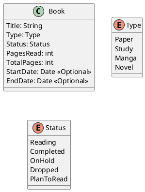

# niikeiのページ

## 目的

niikeiのリンク、本の管理、日記をまとめたページ。

## 使用技術

- github pages
- Google SpreadSheet
- Google Apps Script (GAS)

## 本の管理について

Google SpreadSheetをデータベースとして使用。  
データ構造はMyAnimeListを参考にした。  

GASでデータを取得し、表示する。

### データ構造

