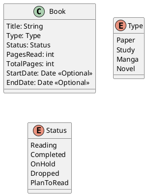

# niikeiのページ

## 目的

niikeiのリンク、本の管理、日記をまとめたページ。

## 使用技術

- github pages
- Google SpreadSheet
- Google Apps Script (GAS)

## 本の管理について

Google SpreadSheetをデータベースとして使用。  
データ構造はMyAnimeListを参考にした。  

GASでデータを取得し、表示する。

### データ構造

```plantuml
@startuml
class Book {
  Title: String
  Type: Type
  Status: Status
  PagesRead: int
  TotalPages: int
  StartDate: Date <<Optional>>
  EndDate: Date <<Optional>>
}

enum Type {
  Paper
  Study
  Manga
  Novel
}

enum Status {
  Reading
  Completed
  OnHold
  Dropped
  PlanToRead
}

@enduml
```

## 記事（Markdown）

記事は `posts/*.md` で管理し、トップページ/記事一覧で表示します。

### 追加手順

1. `posts/YYYY-MM-DD-slug.md` を作成（先頭に `title` / `date`。必要なら `tags` も）
2. `node scripts/build-posts-index.mjs` を実行して `posts/index.json` を更新
3. 変更を commit / push

### tags（例）

- 音楽ページに出したい記事: `tags: music`
